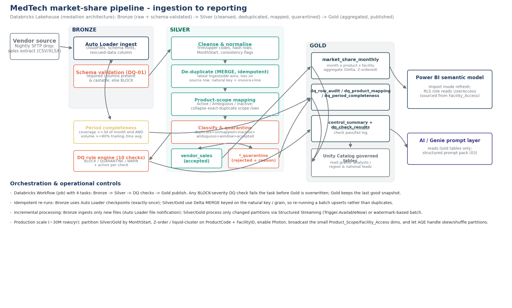

# MedTech market-share pipeline — Databricks design notes

This folder is the ingestion-to-reporting design for the same business logic implemented in
the Power BI Power Query layer (`../01_PowerBI/PowerQuery_M_Scripts.pq`), re-expressed as a
production Databricks Lakehouse pipeline. The transformation logic is written once in
`src/medtech_pipeline/` and is proven, with real PySpark, to reproduce the vendor's own control
totals exactly (`tests/test_pipeline_local.py`).

## 1. Architecture

Medallion architecture on Unity Catalog:

| Layer | Contents | Table(s) |
|---|---|---|
| **Bronze** | Raw vendor rows after Auto Loader ingestion and schema validation (DQ-01). Append-only. | `bronze.vendor_sales_raw`, `bronze.product_scope_raw`, `bronze.facility_access_raw` |
| **Silver** | Cleansed, de-duplicated, mapped, classified. One audit row per Bronze row; one accepted row per clean invoice line. | `silver.dq_row_audit`, `silver.vendor_sales`, `silver.dq_product_mapping`, `silver.dq_period_completeness` |
| **Gold** | Published aggregates and DQ evidence, consumed downstream. | `gold.market_share_monthly`, `gold.dq_check_results`, `gold.control_summary` |

`notebooks/00_setup_ddl.sql` creates the catalog/schema/table structure.
`notebooks/01_bronze_ingest.py` → `02_silver_transform.py` → `04_dq_checks.py` → `03_gold_publish.py`
are wired into a 4-task Databricks Workflow (`resources/job_workflow.json`): the DQ-checks task
gates Gold — if any **BLOCK**-severity check fails, the Workflow stops before Gold is
overwritten, so the published tables always reflect the last run that reconciled.

## 2. Business rules → where they live

| Case study rule | Implementation |
|---|---|
| Trim/upper-case product codes; keep raw for audit | `transforms.clean_vendor` |
| Duplicate invoice lines (latest `IngestedAt` wins) | `transforms.flag_duplicates` (window function, MERGE-idempotent) |
| Duplicate & conflicting active product mappings | `transforms.build_product_mapping` — collapses exact-duplicate scope rows first, then counts **distinct** active `(Brand, Category, Subcategory)` combinations; `>1` ⇒ `Ambiguous` |
| Inactive / unmapped products | `transforms.classify_rows` — precedence duplicate → unmapped → inactive → ambiguous → outside effective window → accepted |
| Incomplete latest month | `transforms.period_completeness` — coverage (last txn within N days of month end) **and** volume (≥ threshold × trailing-3-month average) |
| Repeated totals / double-counting | Gold aggregates from `silver.vendor_sales` (already deduplicated and 1:1 mapped) — never from a naive join to the raw scope sheet |

## 3. Data-quality checks (`src/medtech_pipeline/dq_checks.py`)

10 checks, each returning `(passed, observed, threshold, action)`. Severities:

- **BLOCK** — stop the Workflow before Gold publish; last good Gold snapshot stays live.
- **QUARANTINE** — offending rows are written to a `*_quarantine` table and excluded from Gold; pipeline continues; a steward ticket is implied by the action text (wire to your ticketing system's webhook in production).
- **WARN** — pipeline continues; surfaced on the Power BI Data Quality page and via job email alert.

| ID | Check | Severity |
|---|---|---|
| DQ-01 | Schema contract (required columns present & castable) | BLOCK |
| DQ-02 | Accepted rows unique on natural key | BLOCK |
| DQ-03 | Duplicate delivery rate ≤ 2% | WARN |
| DQ-04 | No product codes with conflicting active mappings | QUARANTINE |
| DQ-05 | No vendor codes missing from Product_Scope | QUARANTINE |
| DQ-06 | Mandatory fields present; SalesAmount ≥ 0; Units > 0 | QUARANTINE |
| DQ-07 | InvoiceMonth consistent with TransactionDate | WARN |
| DQ-08 | Every FacilityID known to the access master | WARN |
| DQ-09 | Latest delivered month passes completeness | WARN |
| DQ-10 | Raw = accepted + rejected, and reconciles to control totals | BLOCK |

Every run's results are appended to `gold.dq_check_results` — an audit trail, not just a
point-in-time pass/fail.

## 4. Idempotency & incremental processing

- **Bronze**: Auto Loader (`cloudFiles`) with a checkpoint — re-running the ingest notebook on
  files already processed ingests nothing new (exactly-once). New files are picked up
  automatically via file notifications (production) or `Trigger.AvailableNow` (scheduled batch).
- **Silver**: `vendor_sales` and `dq_row_audit` are written with **Delta `MERGE`** keyed on the
  natural key (`InvoiceNumber, InvoiceLineNumber`) / `RawRowId`. Re-running the same Bronze batch
  upserts rows in place. A row that was previously accepted but is now rejected (e.g. superseded
  by a later, different delivery, or its mapping became ambiguous) is explicitly deleted from
  `vendor_sales` before the upsert, so the accepted table never drifts from `dq_row_audit`.
- **Gold**: dynamic partition overwrite by `MonthStart` — only the affected months are rewritten,
  and re-running with unchanged Silver data produces byte-identical output.

## 5. Production-scale performance (~30M rows/year)

- **Partitioning**: Bronze/Silver/Gold all partitioned by `MonthStart` — matches the query
  pattern (month-over-month, YoY) and keeps individual partitions Auto Loader/AQE-friendly.
- **Clustering**: `CLUSTER BY (ProductCode, FacilityID)` on `gold.market_share_monthly` (Delta
  Liquid Clustering — the modern replacement for `ZORDER`, since it doesn't require a full
  `OPTIMIZE` rewrite to stay effective as new partitions land) for fast drill-down and RLS
  filtering by facility.
- **Broadcast joins**: `Product_Scope` (33 rows) and `Facility_Access` (30 rows) are always
  broadcast (`F.broadcast(...)` in `transforms.classify_rows`) — the multi-million-row fact never
  shuffles to join a KB-sized dimension.
- **Photon**: enabled on the job cluster (`15.4.x-photon`) — the whole pipeline is
  DataFrame/SQL, no RDD or Python UDFs on the hot path, so it gets the full Photon speedup on
  scans, joins, and aggregations.
- **Adaptive Query Execution**: `spark.sql.adaptive.enabled=true` and
  `spark.sql.shuffle.partitions=auto` let Spark re-plan join strategies and shuffle partition
  counts at runtime instead of hand-tuning for one data volume.
- **Auto-optimize / auto-compact**: enabled on the Delta tables to avoid small-file problems
  from many small daily Auto Loader micro-batches.
- **Incremental Gold**: at 30M rows/year, `03_gold_publish` would move from "recompute the
  affected months" (current design, fine through several years of this volume) to a genuinely
  incremental `MERGE` from a Structured Streaming read of `silver.vendor_sales`'s Change Data
  Feed (`delta.enableChangeDataFeed=true`, already set on `dq_row_audit`) once full-month
  recompute cost becomes material.
- **Change Data Feed** on `dq_row_audit` also gives Power BI (or any downstream consumer) a
  cheap way to detect exactly which rows changed since the last refresh, if incremental refresh
  is later configured in the semantic model.

## 6. What could not be demonstrated locally, and how it would be proven in production

This case study runs everything as local PySpark against a single Excel file, so the following
are documented rather than executed live:

- **Auto Loader file-notification mode** — requires a real cloud storage event queue
  (SQS/Event Grid). Locally, the same code runs in directory-listing mode. In production,
  switch `cloudFiles.useNotifications=true` and grant the notification/queue permissions; test
  by dropping a file and confirming the stream picks it up within the notification latency SLA
  (typically seconds).
- **Delta Live Tables / Workflow retries under partial failure** — tested by manually failing a
  task (e.g. temporarily pointing `landing_path` at a non-existent volume) and confirming the
  Workflow UI shows the downstream tasks as skipped, not run.
- **Unity Catalog row-level security** — the design note in `00_setup_ddl.sql` sketches a row
  filter function keyed on `Facility_Access`, mirroring the Power BI RLS role; this would be
  tested with `ALTER TABLE ... SET ROW FILTER` and querying as a low-privilege service
  principal mapped to a specific analyst's identity.
- **Scale/performance numbers** (Photon speedup, AQE shuffle behavior) — meaningful only at
  realistic volume; the case-study dataset (12k rows) is too small to benchmark. The
  configuration choices above are standard practice for datasets of this shape and would be
  validated with a load test at ~30M rows before go-live.
